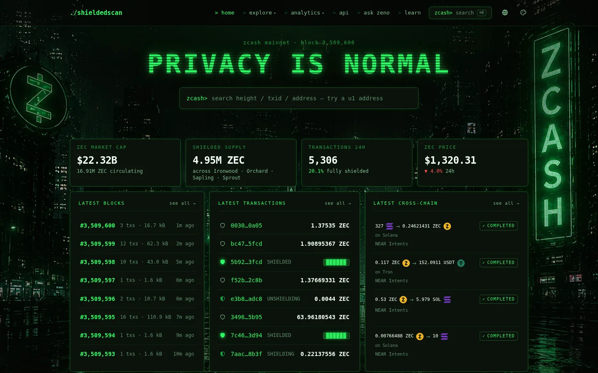

# shieldedscan

A privacy-first Zcash block explorer. Live at **[shieldedscan.xyz](https://shieldedscan.xyz)**
(testnet: [testnet.shieldedscan.xyz](https://testnet.shieldedscan.xyz)).



**Status:** in production on mainnet and testnet. This repository is the code that runs the
site; run locally without configuration and it serves sample data from `src/fixtures/`, not the
chain.

Most explorers show a shielded transaction as an empty cell. shieldedscan treats shielded
activity as first-class: it says what is encrypted, why, and what is still public — and it
never puts a number where the chain is silent.

## What it does

- **Blocks, transactions, addresses** — transparent and shielded, with each transaction's path
  through the pools (`TRANSPARENT → ORCHARD`, `ORCHARD → IRONWOOD`), fees, and the Veil for
  values that are encrypted on-chain.
- **Shielded pool analytics** — Sprout, Sapling, Orchard and Ironwood balances, shielding and
  unshielding flows, pool migrations, fee distributions, supply accounted to the zatoshi.
- **Cross-chain** — ZEC crossing to and from other chains through NEAR Intents, Maya and
  THORChain, per transfer, per chain and per protocol.
- **Network** — a crawler-built map of reachable Zcash nodes, client software, upgrade readiness.
- **Live views** — `/pulse` (the chain as stocks and flows), `/stats`, live block and
  transaction feeds without WebSockets.
- **Learning** — `/learn` walks a newcomer from no ZEC to a first shielded transaction, with a
  practice mode that runs entirely in the browser.
- **Zeno** — an AI assistant grounded in this explorer's own data (`/ai-agent`).
- **Public API and MCP server** — keyless, rate-limited `/v1` REST API
  ([docs](https://shieldedscan.xyz/api-docs)) and a Model Context Protocol server with one tool
  per endpoint ([docs](https://shieldedscan.xyz/mcp)).

## Privacy

No cookies, no client-side tracking, no visitor logs on our own servers. The browser talks only
to this site and its API. [/privacy](https://shieldedscan.xyz/privacy) lists every party a request
passes through.

## Quick start

Requires Node 22 (see `.nvmrc`); 20.19 or later also works.

```bash
npm install
npm run dev
```

Open http://localhost:3000. With no configuration every page renders from typed fixtures in
`src/fixtures/`, so the whole site runs offline.

To develop against real data, point the frontend at an API (see [`.env.example`](.env.example)).
To run the API, the chain follower and the crawler yourself, see
[docs/self-hosting.md](docs/self-hosting.md).

## Architecture

```
Browser ──► Next.js (Netlify) ──► read-only API (Hono, one VPS) ──► Postgres index
                                                                └─► Zakura archive node (RPC)
```

- `src/` — the Next.js app. `domain/` holds the Zcash types and every derivation; `data/` is the
  only place a data source appears; `components/` and `features/` are pure presentation.
- `server/` — the API service, the chain follower, the backfill and repair jobs, the P2P crawler,
  the AI agent, and the public `/v1` + MCP surface. Bundled with esbuild into Docker images.
- `e2e/` — Playwright invariant suites: links, overflow, pagination, filters, privacy, values,
  accessibility.

The rules that keep the data honest are in [ARCHITECTURE.md](ARCHITECTURE.md).

## Scripts

| Command                       | Purpose                                      |
| ----------------------------- | -------------------------------------------- |
| `npm run dev`                 | Development server                           |
| `npm run build` / `npm start` | Production build and serve                   |
| `npm run check`               | `tsc --noEmit` + ESLint                      |
| `npm test`                    | Vitest (DB suites need `TEST_DATABASE_URL`)  |
| `npm run test:e2e`            | End-to-end suites against a production build |
| `npm run verify`              | Everything CI runs                           |
| `npm run build:server`        | Bundle the API service                       |
| `npm run dev:server`          | Bundle and run the API service locally       |

## How this was built

shieldedscan was built by one developer working with AI coding assistants. Every figure the site
shows is checked against the Zcash node and the Postgres index, and the test suite holds the
invariants that matter (no shielded value rendered as a number, pagination with no skipped rows,
fees that reconcile).

## Contributing and security

See [CONTRIBUTING.md](CONTRIBUTING.md). Report vulnerabilities privately as described in
[SECURITY.md](SECURITY.md).

## License

Copyright (C) 2026 BitFalco21.

Licensed under the [GNU Affero General Public License v3.0](LICENSE). If you run a modified
version of this software as a network service, you must make its source available to its users.
Third-party assets keep their own licences; see [THIRD-PARTY-NOTICES.md](THIRD-PARTY-NOTICES.md).
